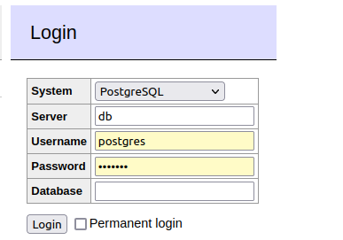

# Avito Segments

## Описание проекта
В данном проекте реализовано:
* Метод создания сегмента. Принимает slug (название) сегмента.
* Метод удаления сегмента. Принимает slug (название) сегмента.
* Метод добавления пользователя в сегмент. Принимает список slug (названий) сегментов которые нужно добавить пользователю, список slug (названий) сегментов которые нужно удалить у пользователя, id пользователя.
* Метод получения активных сегментов пользователя. Принимает на вход id пользователя.

Также:
* Сервис использует JSON при отправке и получения запросов.
* Программируем язык: Go.
* Docker-compose для поднятия рабочей среды.
* Имеется swagger. Был создан с помощью postman.
* Также имеется история или журнал, TTL (время автоматического удаления пользователя из сегмента) и автоматический(случайный) способ добавления пользователей в сегмент.

## Установка
1. Нужен установленный Golang. 
2. База данных и доступ к ней присутствует в docker-compose, для взаимодействия с базой имеется Adminer (доступный по localhost:8080)

## Начало работы.
1. Открываем терминал (в корневой папке проекта) вводим команду - docker-compose up
2. Перейти по адресу localhost:8080 после поднятия compose'а. Залогиниться*, можно изменить данные в .env файле.
3. В корнейвой папке запустить команду go run . 
4. После данных настроек, можете использовать curl localhost:8081 или postman для доступа и работы с данной программой. Вот список команд:

### * Дефолтные данные для входа. (DBhost = localhost; DBport = 5432; DBuser = postgres; DBpassword = example; DBname = postgres)

Существуют следующие точки обращения:
      
      /user/:user_id
      Показывает информацию о пользователе с указанием сегментов, в которых находится пользователь.

      /newSeg/:slug
      Создает новый сегмент с slug в качестве имени.

      /newSegAutoAdd/:slug/:percent
      Создает новый сегмент со slug в качестве имени и добавляет в него процент пользователей.

      /rmSeg/:slug
      Удаляет сегмент на основе slug

       /add/:slug/:id
      Добавляет пользователя в сегмент. Необходимо указать имя сегмента и идентификатор пользователя.

      /addTTL/:slug/:id/:ttl
      Добавляет пользователя в сегмент с TTL в днях.

      /remove/:slug/:id
      Удаляет пользователя из сегмента
